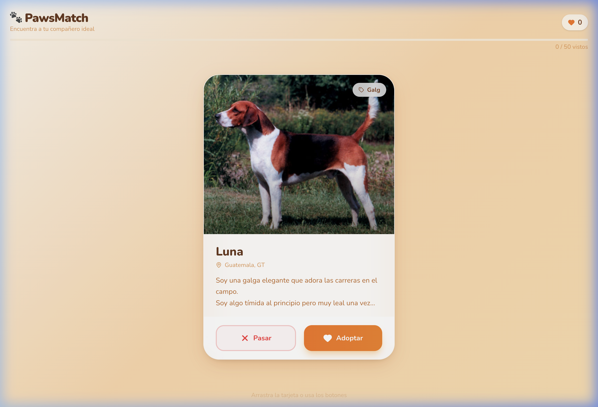

# App Showcase

Welcome to the native pet adoption app! Here's a brief look at the UI and interaction features.

## Landing State

## Interaction Demo

## Technical UI/UX Features Implemented
- **Tinder-like Swiping Physics:** Smooth, responsive drag-and-drop gesture feedback. Left and right swiping transitions managed dynamically for a native feel.
- **Modern Atomic CSS Styling:** Built utilizing `tailwindcss` for a highly responsive, polished interface with clean card layouts, subtle shadows, and matching typography.
- **Dynamic Micro-animations:** Powered by `@vueuse/motion` with smooth transitions, entrance animations, and reactive touch layouts for an immersive UX.
- **Iconography:** Employs `lucide-vue-next` for sleek, scalable SVG icons across action buttons and details pages.

---

# Vue 3 + TypeScript + Vite

This template should help get you started developing with Vue 3 and TypeScript in Vite. The template uses Vue 3 `<script setup>` SFCs, check out the [script setup docs](https://v3.vuejs.org/api/sfc-script-setup.html#sfc-script-setup) to learn more.

Learn more about the recommended Project Setup and IDE Support in the [Vue Docs TypeScript Guide](https://vuejs.org/guide/typescript/overview.html#project-setup).

